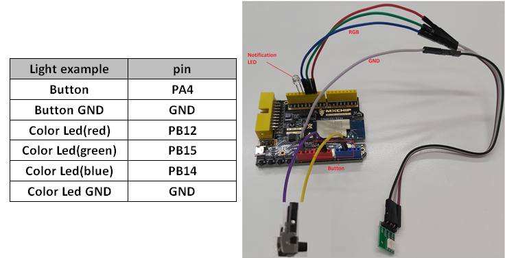

# SmartThings SDK for Direct Connected Devices for C - Light Example

## Introduction

SmartThings direct-connected device is Wi-Fi enabled device that uses the SmartThings cloud as its primary cloud infrastructure. And this device will use the MQTT protocol for communication.

## Getting started

For information on detailed workflow, please refer to the [Getting Started](../../../doc/getting_started.md)

## Components and Capabilities

SmartThings Device is defined using components and capabilities. Capabilities define the features of the device, and capabilities are grouped into components.
Components and Capabilities are contained in device profile. You can create a device profile in Developer Workspace and associate it with an integration.

This example assumes the following components and capabilities are used:

'main' component
- 'healthCheck' capability
- 'switch' capability
- 'switchLevel' capability
- 'colorTemperature' capability
- 'activityLightingMode' capability

'monitor' component
- 'dustSensor' capability

('healthCheck' capability is automatically added by Developer Workspace. It doesn't need handler at device side)

## SmartThings SDK for Direct Connected Devices - Config
If you want to use specific SmartThings Device SDK build options, you can directly modify the build configuration file. For this example, SmartThings Device SDK config is saved in 'sdkconfig.h' file. If you want to change this, please execute the following :
```sh
$ cd ~/st-device-sdk-c-ref
$ vim apps/emw3166/light_example/sdkconfig.h
```

## Test device schematics
This example uses EMW3166 GPIO like below.
Please refer below picture for __MXChip EMW3166__.
> Note: If your device's schematics doesn't match with belows.
> Please modify GPIO defines for your device at [device_control.h](main/device_control.h)
> ```c
> #define GPIO_INPUT_BUTTON        MICO_GPIO_38   //PA4
> #define GPIO_OUTPUT_COLORLED_R   MICO_GPIO_5    //PB12
> #define GPIO_OUTPUT_COLORLED_G   MICO_GPIO_4    //PB15
> #define GPIO_OUTPUT_COLORLED_B   MICO_GPIO_7    //PB14
> #define GPIO_OUTPUT_COLORLED_0   MICO_GPIO_6    //PB13
> ```

### MXChip EMW3166
| MXChip EMW3166                                                       |
|-----------------------------------------------------------------------|
| |
