# ESP32 Switch Demo

## 1. Introduction

SmartThings direct-connected device is Wi-Fi enabled device that uses the SmartThings cloud as its primary cloud infrastructure. And this device will use the MQTT protocol for communication.

This is for an example device application installed on the IoT device. For an easier and more practical understanding about the development of IoT device applications, we described in detail the execution results of scripts, commands, and UI used in the Demo below.

However, the detailed results of these execution used in the basic flow can be modified at any time through an upgrade of STDK due to improvements. In this case, the basic flow itself will be valid. And we will update these changes first in the [Getting Started](https://github.com/SmartThingsCommunity/st-device-sdk-c-ref/blob/master/doc/getting_started.md) document.

## 2. Setup Environment

The first thing you need to do is set up your programming environment in a Linux PC.

### 2.1. Get STDK source code

Download the Reference repository from GitHub.

- [Reference](https://github.com/SmartThingsCommunity/st-device-sdk-c-ref)

From the terminal, navigate to the home directory and clone the STDK using the following git command:

```sh
$ cd ~
$ git clone https://github.com/SmartThingsCommunity/st-device-sdk-c-ref.git
```

You can use a script to automatically download the `IoT Core Device Library` and `this chipset vendor's SDK` as follows:

```sh
$ cd ~/st-device-sdk-c-ref
$ ./setup.sh
    Usage: ./setup.sh CHIP_NAME
- - - - - - - - - - - - - - - - - - -
    ex) ./setup.sh esp8266
    ex) ./setup.sh esp32
    ex) ./setup.sh rtl8195
    ex) ./setup.sh rtl8720c
    ex) ./setup.sh rtl8721c

$ ./setup.sh esp32                       # ./setup.sh {chip_name}
```

### 2.2. Create device identity for test device

In order for your IoT device to connect to the SmartThings Cloud, there are required authentication data files. To create these authentication data, you must know your MNID in the personal information window of  [Developer Workspace](https://smartthings.developer.samsung.com/workspace/). Please sign in with Samsung Account and then check your MNID first.

Open a terminal window and run the following `stdk-keygen` command to create a Device Identity.

```sh
$ cd ~/st-device-sdk-c-ref/iot-core/tools/keygen/linux
$ ./stdk-keygen -h
usage: stdk-keygen -m MNID [-f firmware_version]

$ ./stdk-keygen -m **** -f V202006       # replace '****' with your MNID
Go Device Identity of Developer Workspace.

Serial Number:
┌──────────┬──────────┐
│ STDK**** │ ce**2**3 │
└──────────┴──────────┘

Public Key:
1D********a21F********8WwP********yU/n8vFvM=

$ tree
.
├── ed25519.pubkey
├── ed25519.seckey
└── output_STDK****ce**2**3
    └── device_info.json
$
$ cat output_STDK****ce**2**3/device_info.json
{
  "deviceInfo": {
    "firmwareVersion": "V202006",
    "privateKey": "3d********AOyY********ezJQ********TMKLGxzbQ=",
    "publicKey": "1D********a21F********8WwP********yU/n8vFvM=",
    "serialNumber": "STDK****ce**2**3"
  }
}
```

Copy the Serial Number and Public Key after running the command. You will need to upload these values to the SmartThings Cloud via [Developer Workspace](https://smartthings.developer.samsung.com/workspace/projects) during the next phase.

If you create a device identity with a command with an option like above,  You can get the ready-to-use `device_info.json` file directly.

### 2.3. Setup toolchain

You need to setup a esp32-idf.

ESP32-IDF supports multiple host environments including Windows, Linux, and macOS. This document will uses Linux environment.   
Please refer _Example for ESP32_ section from below link

- [Quick start for Linux](../../../README.md#prerequisites)

## 3. Register a Device

Now that the programming environment is setup, you need to register device information to the SmartThings Cloud.

First, please sign in to the [Developer Workspace](https://smartthings.developer.samsung.com/workspace/) with a Samsung Account.

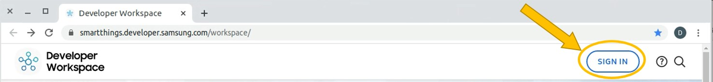


### 3.1 Create a new project

Press "NEW PROJECT" button and select "Device Integration".

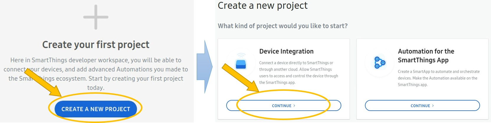

Select Direct-connected device and enter a name for this project.

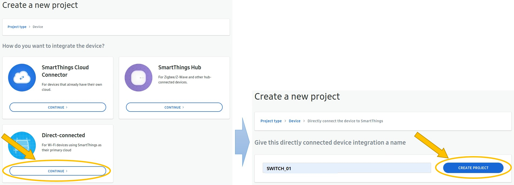

After pressing "CREATE PROJECT" button, a direct-connected device project will be created on the SmartThings Cloud.


### 3.2. Create a device profile

A device profile contains the components, capabilities, and metadata (ID, name, etc.). This information defines the actions and attributes that an IoT device can perform.

Click the "GO TO DEVICE PROFILE" and then, enter the all remaining information required.

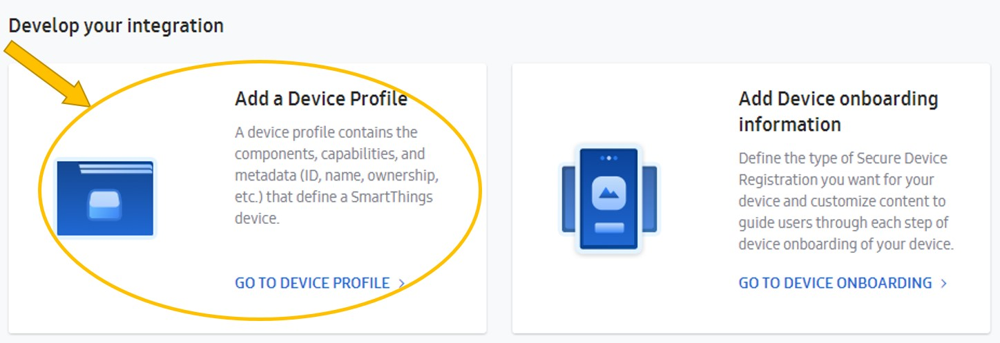

At this time, please note that you will need to add a "[Health Check](https://smartthings.developer.samsung.com/docs/devices/health.html)" capability to update the connectivity status of a device. It is only required on the `main` component.

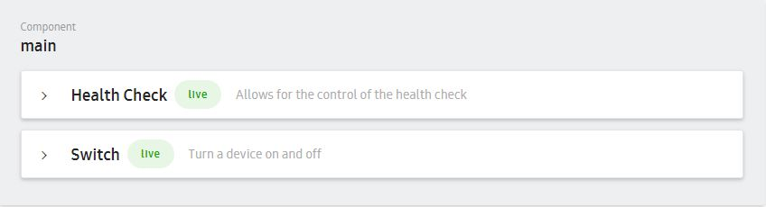


### 3.3. Create device onboarding information

This defines information to support the initial connection process between IoT device and SmartThings Cloud.

Click the "GO TO DEVICE ONBOARDING" and then, enter the all remaining information required.

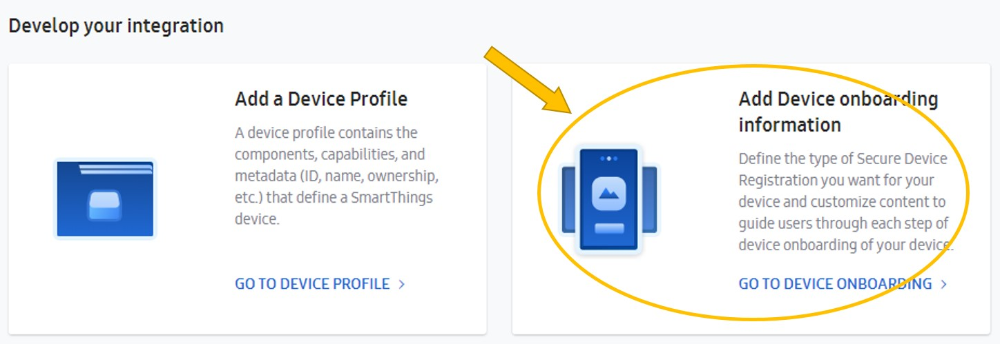


### 3.4. Deploy to test

You can publish your device to the SmartThings platform for testing. And then you will be able to access your device through the SmartThings app. Actually this step is for self-testing. If you want to officially publish your device with enrolled organizations ID(e.g. company MNID), please refer to the process below.

- [Official Publishing Process](https://smartthings.developer.samsung.com/docs/devices/publishing/publishing-basics.html)

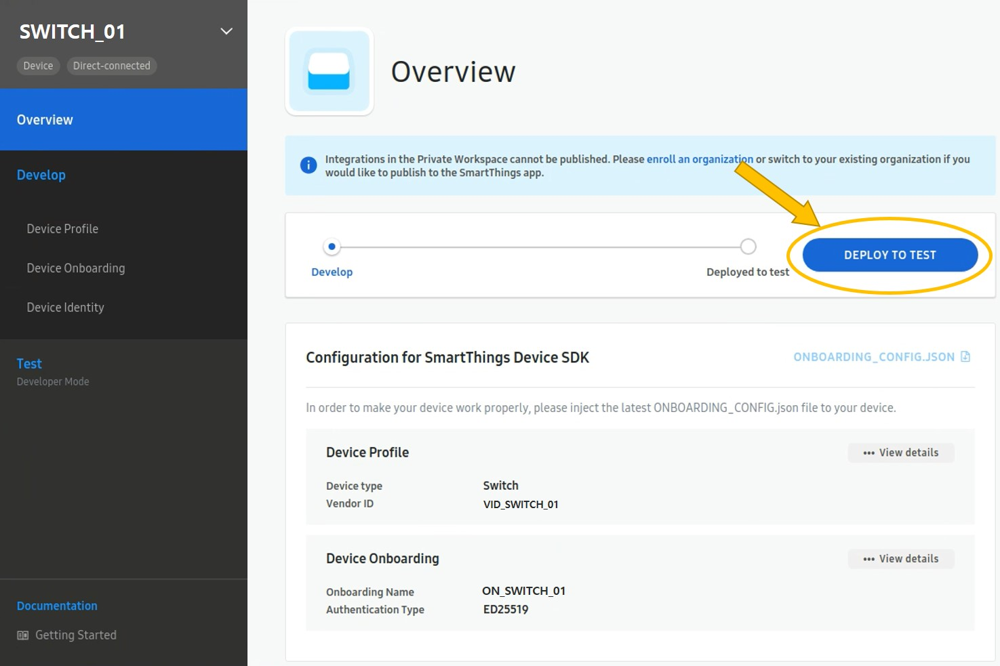


### 3.5. Upload device identity

This step uploads device identity data generated in the previous phase.

Enter the serial number.

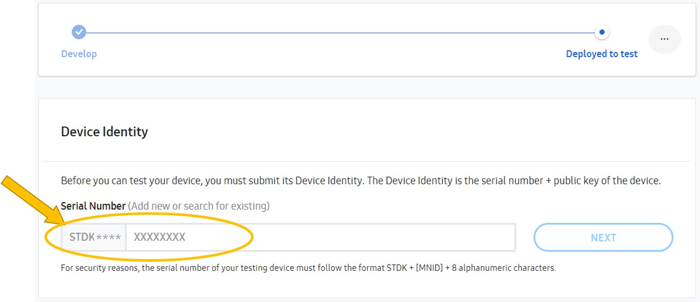


Paste the public key that copied from the previous phase in the Public Key value box that appears.

And then, click ADD button.

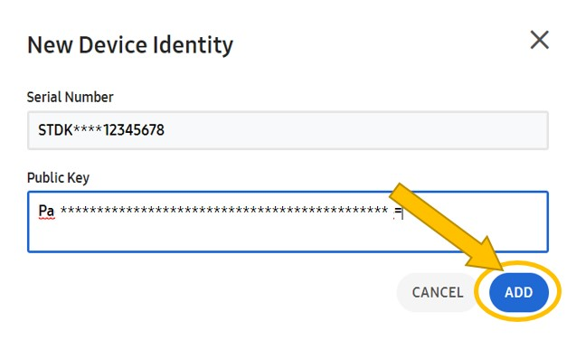


### 3.6. Download onboarding_config.json

This is the information that the IoT device must have in order to connect to the SmartThings Cloud.

If you use a pre-supplied sample device application, please download it, and then just overwrite the existing `onboarding_config.json` file is in the `main` directory of sample device application with the new one you downloaded.

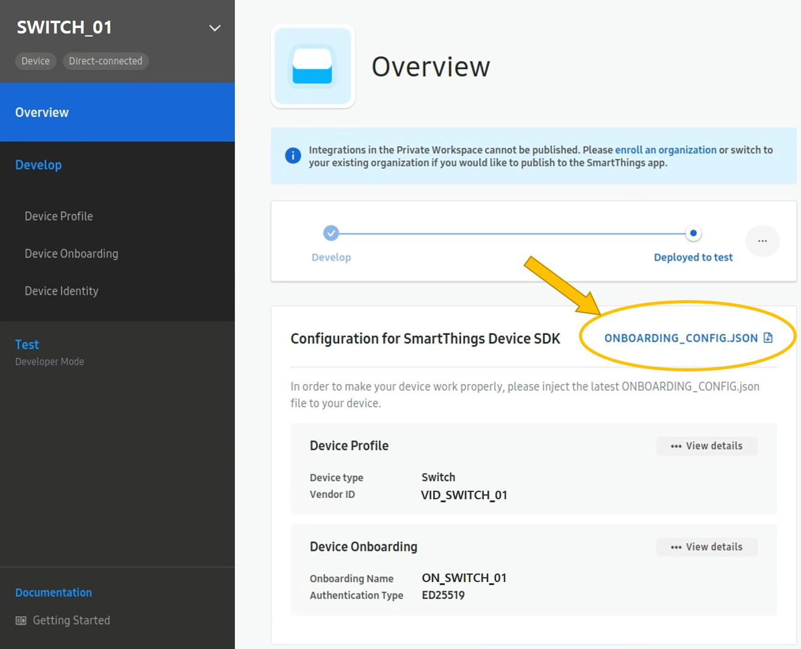


## 4. Develop a device application

You have set up the environment and registered a device, so now it is time to develop a new device application in the STDK reference repository.

### 4.1. Check the sample device application directory

Navigate to the device application directory and check it as follows :

```sh
# switch device application
$ cd ~/st-device-sdk-c-ref/apps/esp32/st_switch/
$ tree
.
├── debug_sdkconfig
├── main
│   ├── component.mk
│   ├── device_control.c
│   ├── device_control.h
│   ├── device_info.json
│   ├── Kconfig.projbuild
│   ├── onboarding_config.json
│   └── smart_switch.c
├── Makefile
├── partitions.2MB.csv
├── README.md
└── sdkconfig

1 directory, 12 files
```

### 4.2. Update device information

In order to properly connect to the SmartThings cloud, you must equally update the device information registered in the cloud to IoT devices. There are two types of information that need to be updated as follows:

- device_info.json

  If you create a device identity with a command with an option like `./stdk-keygen -m **** -f V202006` like the second phase,  you can get the ready-to-use `device_info.json` file directly. In this case, please make sure you overwrite the existing `device_info.json` file with the new one you created.

  ```sh
  # overwrite device_info.json file
  $ cp ./output_STDK****ce**2**3/device_info.json ~/st-device-sdk-c-ref/apps/esp32/st_switch/main/
  ```

- onboarding_config.json

  Place the `onboarding_config.json` file created during the device registration phase in the `main` directory of device application. Please make sure you overwrite the existing `onboarding_config.json` file with the new one you created like `device_info.json` file above.

  ```sh
  # Path to the file to be overwritten
  ~/st-device-sdk-c-ref/apps/esp32/st_switch/main/onboarding_config.json
  ```

### 4.3. Setup GPIO pins

This device application uses single switch and LED like below schematics with ESP32 DEVKITC V4.

If you uses another schemtics, you can modify GPIO pin settings in `~/st-device-sdk-c-ref/apps/esp32/st_switch/main/device_control.h`. 

Please refer to the pin information by reference board below.

| ESP32_DEVKITC                                                |
| ------------------------------------------------------------ |
|  |


### 4.4. Build & Flash the App

Go to the root directory of the STDK and execute the build script(build.sh) with the below parameter.

```sh
$ cd ~/st-device-sdk-c-ref/
$ ./build.sh esp32 st_switch             # ./build.sh {chip_name} {app_directory}
```

After compiling, following results can be seen. In fact, as you know, we have to flash these results according to the binary download method that exists per chipset.

```sh
$ tree output/ -L 3
output/
`-- esp32
    `-- iotcore_st_switch_20200211_ab144f7_d63f3d2   
#iotcore_'app_name'_'date'_'commit'
        |-- address_info.txt
        |-- bootloader.bin
        |-- debug
        |-- ota_data_initial.bin
        |-- partitions.2MB.bin
        `-- smart_switch_demo.bin
```

In case of Espressif chipset(e.g. ESP8266, ESP32), you can now run the following command to flash the entire binaries(e.g. app, bootloader, and init data bin) to the chipset.

```sh
# ./build.sh {chip_name} {app_name} {option}
$ cd ~/st-device-sdk-c-ref/
$ ./build.sh esp32 st_switch flash
```

> **Note :**
>
> The serial port needs to be matched to the computer environment for serial port flashing. For example, the settings for serial port flashing can be configured with `menuconfig` option in Espressif. If the serial port setting does not match your environment, please execute the following :
>
> ```sh
> # ./build.sh {chip_name} {app_name} {option}
> $ cd ~/st-device-sdk-c-ref
> $ ./build.sh esp32 st_switch menuconfig
> ```
>
> - Baud rate 115200 for flashing or 74880 for monitoring, Date bit 8, Parity None, Stop bits 1

Plus, You don't need to run `./build.sh esp32 st_switch` before running `./build.sh esp32 st_switch flash`, this will automatically rebuild everything that needs to be built before flashing.

Also, multiple options can be used simultaneously like `./build.sh esp32 st_switch flash monitor`.

### 4.5. Test

The SmartThings App should be used to control an IoT device that is running with the SmartThings Cloud. Go to Google Play or the iOS App Store and download the SmartThings app on your phone.

| Step | Description                                                  |
| :--: | ------------------------------------------------------------ |
|  1   | **Enable developer mode**<br>You must enable the `Developer Mode` in the SmartThings app before testing.<br>For more details, please refer to the link below.<br>https://smartthings.developer.samsung.com/docs/testing/developer-mode.html<br>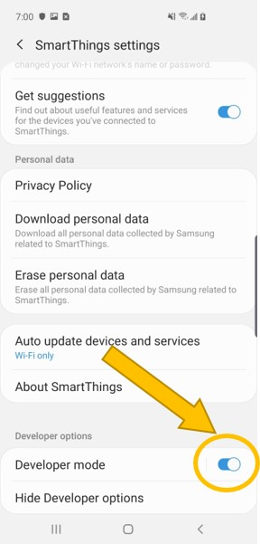 |
|  2   | **Reset the device**<br>Just push the reset button of device.<br><br>If you use an Espressif chipset, you can also run the `monitor` command to reset the device in the console window like below.<br>  $ cd ~/st-device-sdk-c-ref<br>  $ ./build.sh esp32 st_switch monitor         # This is only for Espressif chipset. |
|  3   | **Add device(Onboarding Process)**<br>Select the `Device Onboarding Name` via "My Testing Devices" menu. <br>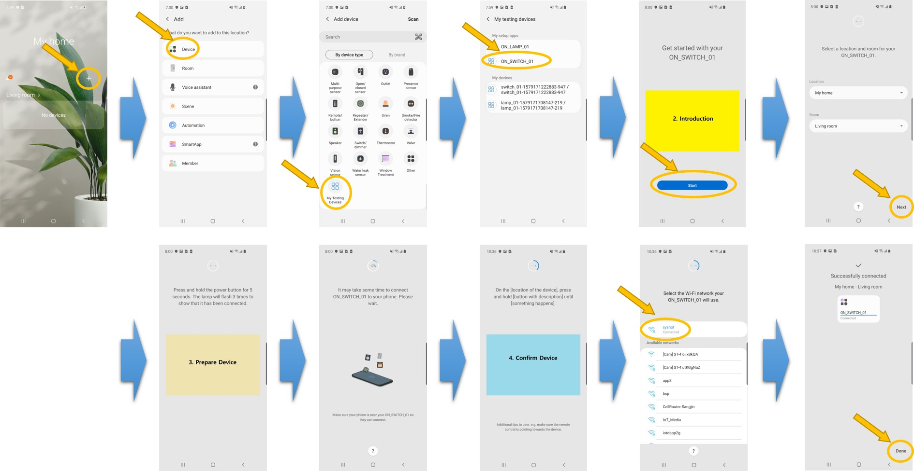<br><br>|
|  4   | **Control & Monitor a device**<br>Now that your device is on the SmartThings App. If there is no problem during above onboarding process, it means your device is well registered to the SmartThings Cloud. <br><br>Control & Monitor your device via the App and make sure the App is working the way you think it should.<br>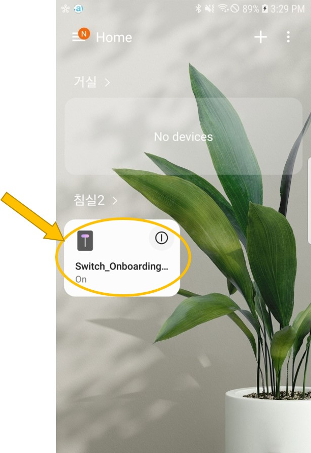 |