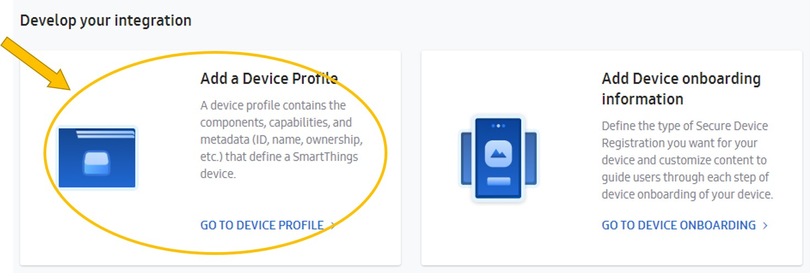
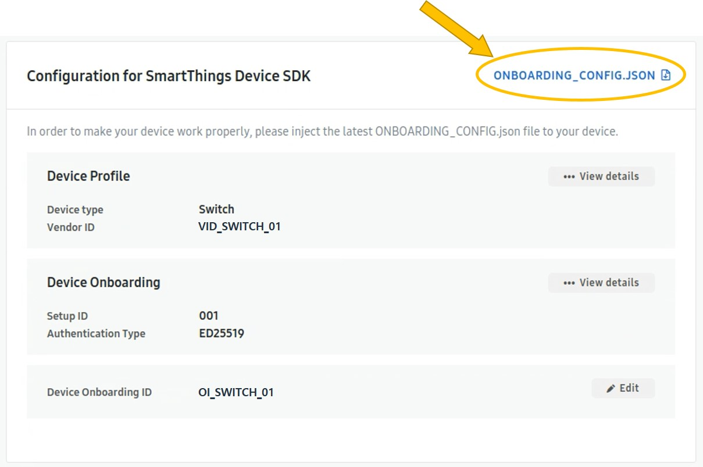
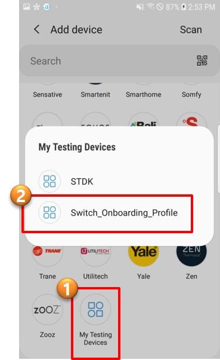

# Getting Started for Direct-connected device

SmartThings Direct-connected devices are Wi-Fi enabled devices that use the SmartThings cloud as their primary cloud infrastructure. Your device will use the MQTT protocol for communication.

This article demonstrates how to integrate a direct-connected device with SmartThings.

## Workflow

When developing a new direct-connected device application with SmartThings Device SDK (STDK for short), you will progress through the following steps.

- [Setup Environment](#Setup Environment)

- [Register a Device](#Register a Device)

- [Develop a Device Application](#Develop a device application)

  

## Setup Environment

The first thing you need to do is set up your programming environment.

### Get STDK source code

There are two git repositories for working with the SmartThinks SDK. One git repository has the core Internet of Things (IoT) library while the second git repository has example device applications.

- [IoT Core Device Library](https://github.com/SmartThingsCommunity/st-device-sdk-c)
- [Reference](https://github.com/SmartThingsCommunity/st-device-sdk-c-ref)

#### Download [Reference](https://github.com/SmartThingsCommunity/st-device-sdk-c-ref)

You can choose to only download the [Reference repository](https://github.com/SmartThingsCommunity/st-device-sdk-c-ref) from git, if you have already ported your project. The `IoT Core Device Library` is downloaded as a submodule in the `Reference`.

From the terminal, navigate to the directory you want the STDK to live and clone it using the following git command:

```sh
cd ~
git clone https://github.com/SmartThingsCommunity/st-device-sdk-c-ref.git
```

> **Note** : For the rest of this document, we will assume the above path (~/st-device-sdk-c-ref) is the default reference source code.

You can use a script to setup a chipset SDK as follows:

```sh
cd ~/st-device-sdk-c-ref
./setup.sh
    Usage: ./setup.sh CHIP_NAME
- - - - - - - - - - - - - - - - - - -
    ex) ./setup.sh esp8266
    ex) ./setup.sh esp32
    ex) ./setup.sh rtl8195

./setup.sh esp8266                       # ./setup.sh {chip_name}
```

#### Create device identity

In order for your IoT device to connect to the SmartThings Cloud, there are authentication data files required. To create authentication data, you must know your MNID in the personal information window of  [Developer Workspace](https://smartthings.developer.samsung.com/workspace/). Please sign in with Samsung Account and check your MNID first.

Open a terminal window and run the following `stdk-keygen` command to create a Device Identity.

```sh
$ cd ~/st-device-sdk-c-ref/iot-core/tools/keygen/linux
i$ ./stdk-keygen -h
usage: stdk-keygen -m MNID [-f firmware_version]
$
$ ./stdk-keygen -m **** -f V201910       # replace '****' with your MNID
For Device Identity of Developer Workspace,

Serial Number:
STDK************

Public Key:
********************************************
$
$ tree
.
├── ed25519.pubkey
├── ed25519.seckey
└── output_STDK************
    └── device_info.json
```

Copy the Serial Number and Public Key after you run the command on your computer. You will need to upload that value to the SmartThings Cloud via [Developer Workspace](https://smartthings.developer.samsung.com/workspace/projects) during the next phase.

If you create a device identity with a command with an option like above,  You can get the ready-to-use device_info.json file directly.

#### Setup toolchain

You must setup a toolchain according to each chipset you selected.

***Example for ESP8266*** :

*For additional information see the following git repositories.*

- *[ESP8266 RTOS Example](https://github.com/espressif/ESP8266_RTOS_SDK/tree/release/v3.2)*
- *[ESP8266 Docs](https://docs.espressif.com/projects/esp8266-rtos-sdk/en/latest/index.html)*

*ESP8266 supports multiple host environments including Windows, Linux, and macOS. Based on experience, compile times are significantly faster on Linux but it is up to you which environment you prefer to use.*

1. *Install Prerequisites*

   *Get the following packages :*

   ```sh
   sudo apt-get install gcc git wget make libncurses-dev flex bison gperf python python-pip python-setuptools python-serial python-cryptography python-future python-pyparsing python-pyelftools
   ```

   > ***Note :***
   >
   > *Some older Linux distributions may be missing some of the Python packages listed above.*
   >
   > *Also note pyserial version 2.x is not supported by ESP-IDF.*

2. *Setup Toolchain*

   *Get the ESP8266 toolchain for Linux, available on the Expressif website:*

   - *[64-bit Linux](https://dl.espressif.com/dl/xtensa-lx106-elf-linux64-1.22.0-92-g8facf4c-5.2.0.tar.gz)*

   - *[32-bit Linux](https://dl.espressif.com/dl/xtensa-lx106-elf-linux32-1.22.0-92-g8facf4c-5.2.0.tar.gz)*

   *Once the file is downloaded, extract it in the ~/esp directory.*

   ```sh
   mkdir -p ~/esp
   cd ~/esp
   tar -xzf ~/Downloads/xtensa-lx106-elf-linux64-1.22.0-92-g8facf4c-5.2.0.tar.gz
   ```

   *The above command places the files in the ~/esp/xtensa-lx106-elf/ directory.*

   *According to the original ESP8266 guideline, you will need to add it to your PATH environment variable in ~/.profile file. But If you installed the toolchain along the step above, it is not necessary. Because that path is exported in the build script.*

## Register a Device

Now that the environment is setup, you need to register a device.

First, please sign in to the [Developer Workspace](https://smartthings.developer.samsung.com/workspace/).

### Create a new project

Select Direct-connected device.


Enter a name for the project, and then press "CREATE PROJECT" button to create a direct-connected device project on the SmartThings Cloud.


### Create a device profile

A device profile contains the components, capabilities, and metadata (ID, name, etc.) that defined in a SmartThings IoT device.

Click the "GO TO DEVICE PROFILE" and then, enter the all remaining information required.




### Create a device onboarding profile

Click the "GO TO DEVICE ONBOARDING" and then, enter the all remaining information required.


### Deploy to test

You can publish it on the SmartThings catalog server. And then you will be able to access your device in the SmartThings app.


### Upload device identity

This step uploads device identity data generated in the first phase.

Enter the serial number.


Paste the public key that copied from the first phase in the Public Key value box that appears

And then, click ADD button.


### Download onboarding_config.json

This is the information that the IoT device must have in order to connect to the SmartThings Cloud Server.

Please download it.




## Develop a device application

You have the environment set up and you have registered a device, so now it is time to create a new device project.

### Create a new device project

An easy way to get started is to branch off of one of the example projects provided in the git repository. We will use the "st_switch" application from the STDK directory here.

```sh
# Full path of the ESP8266
~/st-device-sdk-c-ref/apps/esp8266/st_switch/
```

### Update device information

Your IoT device needs two pieces of information before connecting to the SmartThings Cloud Server:

- Device Identity
- onboarding_config.json

1. Device Identity

   Device identity provides data that needs to be sent for authentication with the server. There are two different packets of information, one for the individual developer and one for the manufacturer.

   - Individual developer

     All of the data below should be included in the device_info.json file in the `main` directory of the device application.

     **[For ED25519]**

     If you create a device identity with a command with an option like `./stdk-keygen -m **** -f V201910` like the first phase,  you can get the ready-to-use device_info.json file directly.

     ```sh
     $ cd ~/st-device-sdk-c-ref/iot-core/tools/keygen/linux
     $ tree
     .
     ├── ed25519.pubkey
     ├── ed25519.seckey
     └── output_STDK************
         └── device_info.json

     $ cat output_STDK************/device_info.json
     {
       "deviceInfo": {
         "firmwareVersion": "V201910",
         "privateKey": "********************************************",
         "publicKey": "********************************************",
         "serialNumber": "STDK************"
       }
     }
     ```

   -  Manufacturer

     For the manufacturer, we cannot place the device identity files in the source code because it is impossible to build and flash every time for each device. To solve this problem, the production level application should store device identity files for each device in a secure location during the manufacturing process. For example, device identity data will be flashed into the SmartThings Non-Volatile memory location.

     **[For ED25519]**

     | Flashed items | Type | Description                   | Examples          |
     | :------------ | :--- | :---------------------------- | :---------------- |
     | PKType        | data | PubKey Algorithm type         | ED25519           |
     | CACert        | file | Server CA Certificate         | root.crt.pem      |
     | PublicKey     | file | Client (= Device) Public key  | device.pubkey.b64 |
     | PrivateKey    | file | Client (= Device) Private key | device.seckey.b64 |
     | SerialNum     | data | Device Serial Number          | cc50e309dcd0      |

2. onboarding_config.json

   Place the onboarding_config.json file created during the device registration phase in the `main` directory of device application.

   ***Example***

   ```sh
   # Location for ESP8266
   ~/st-device-sdk-c-ref/apps/esp8266/st_switch/main/onboarding_config.json
   ```

   ```sh
   # Example of onboarding_config.json
   {
     "onboardingConfig": {
       "deviceOnboardingId": "STDK",
       "mnId": "****",
       "setupId": "001",
       "vid": "STDK_SMARTLAMP_0001",
       "deviceTypeId": "Switch",
       "ownershipValidationTypes": [
         "BUTTON"
       ],
       "identityType": "ED25519"
     }
   }
   ```

   - deviceOnboardingId : It is a prefix to be used for the SSID of Soft-AP during Easy-setup process. This value comes from ‘Device Onboarding ID’ when doing `Create a device information` on the DevWS.
     - Example of SSID : STDK[x28d]
   - mnId : Manufacturer ID. A unique four-letter ID assigned to SmartThings developers (individual MNID) or enrolled organizations (company MNID) that can be viewed at My Page > MNID.
   - setupId : a unique three-digit number. This value comes from ‘Device onboarding ID’ when doing `Create a device onboarding profile` on the DevWS.
   - vid :   An alphanumeric identifier for your device. This value comes from ‘VID(Vendor ID)’ when doing `Create a device profile` on the DevWS.
   - deviceTypeId : This determines the device's icon and default UI layout in the SmartThings app. This is the value you selected from the value given as a list when doing `Create a device profile`.
   - ownershipValidationTypes : This is the type of ownership confirmation used during onboarding process. There are four supported types
     - JUSTWORKS
     - BUTTON
     - PIN
     - QR

   - identityType : A unique certificate or public key pair type used to authenticate a device on SmartThings Cloud Server. You can choose between
     - ED25519
     - *X.509 (will be supported)*

### Develop device application

A device application is developed using the APIs provided by the IoT Core Library. We recommend reuse of the pre-supplied sample applications, like st_switch. This allows for rapid development as you begin to develop your new device. Please refer to the API references related to the IoT core device library as shown:

- connection management
  - st_conn_init()
  - st_conn_set_noti_cb()
  - st_conn_start()
  - st_conn_cleanup()
  - st_conn_ownership_confirm()

- capability management
  - st_cap_handle_init()
  - st_cap_cmd_set_cb()
  - st_cap_attr_create_int()
  - st_cap_attr_create_number()
  - st_cap_attr_create_string()
  - st_cap_attr_create_string_array()
  - st_cap_attr_free()
  - st_cap_attr_send()

***Main function example for ESP8266*** :

```sh
/**
SmartThings Device Kit(STDK) aims to make it easier to develop IoT devices by providing
additional IoT Core Library to the existing chip vendor SW Architecture.

That is, you can simply develop a basic application by just calling the APIs provided by IoT Core Library like below. Currently, IoT Core Library offers 13 APIs.

//create an iot context
1. st_conn_init();

//create a handle to process capability
2. st_cap_handle_init();

//register a callback function to process capability command when it comes from the SmartThings Server.
3. st_cap_cmd_set_cb();

//needed when it is necessary to keep monitoring the device status
4. user_defined_task()

//process on-boarding procedure. There is nothing more to do on the app side than call the API.
5. st_conn_start();
*/

void app_main(void)
{

    unsigned char *onboarding_profile = (unsigned char *) onboarding_profile_start;
    unsigned int onboarding_profile_len = onboarding_profile_end - onboarding_profile_start - 1;
    unsigned char *device_info = (unsigned char *) device_info_start;
    unsigned int device_info_len = device_info_end - device_info_start - 1;
    IOT_CAP_HANDLE *handle = NULL;
    int iot_err;

    // 1. create an iot context
    ctx = st_conn_init(onboarding_profile, onboarding_profile_len, device_info, device_info_len);
    if (ctx != NULL) {
      iot_err = st_conn_set_noti_cb(ctx, cap_switch_noti_cb, NULL);
      if (iot_err)
        printf("fail to set notification callback function\n");

    // 2. create a handle to process capability
    // implement init_callback function (cap_switch_init_cb)
    handle = st_cap_handle_init(ctx, "main", "switch", cap_switch_init_cb, NULL);

    // 3. register a callback function to process capability command when it comes from the SmartThings Server
    // implement callback function (cap_switch_cmd_off_cb)
    iot_err = st_cap_cmd_set_cb(handle, "off", cap_switch_cmd_off_cb, NULL);
    if (iot_err)
      printf("fail to set cmd_cb for off\n");

    // implement callback function (cap_switch_cmd_on_cb)
    iot_err = st_cap_cmd_set_cb(handle, "on", cap_switch_cmd_on_cb, NULL);
    if (iot_err)
      printf("fail to set cmd_cb for on\n");

    } else {
      printf("fail to create the iot_context\n");
    }

    // 4. needed when it is necessary to keep monitoring the device status
    xTaskCreate(smartswitch_task, "smartswitch_task", 2048, (void *)handle, 10, NULL);

    // 5. process on-boarding procedure. There is nothing more to do on the app side than call the API.
    st_conn_start(ctx, (st_status_cb)&iot_status_cb, IOT_STATUS_ALL, NULL, NULL);

}
```

### Build & Flash the App

Go to the root directory of the STDK and execute the build script(build.sh) with the below parameter.

```sh
cd ~/st-device-sdk-c-ref/
./build.sh esp8266 st_switch             # ./build.sh {chip_name} {app_directory}
```

After compiling, you should see a result similar to below.

```sh
# Example for ESP8266
|-- output
| `-- iotcore_st_switch_20190719_771f5140   # iotcore_'project_name'_'date'_'commit_id'
| |-- address_info.txt
| |-- bootloader.bin
| |-- debug
| |-- partition.bin
| `-- st_switch_demo.bin
```

You can now execute the following command to flash the entire project (app, bootloader, and init data bin) to a new chip.

```sh
cd ~/st-device-sdk-c-ref/
./build.sh esp8266 st_switch flash
```

The serial port needs to be matched to the computer environment for serial port flashing. For example, in ESP8266 the settings for serial port flashing can be configured with `make menuconfig`. If the serial port setting does not match your environment, please execute the following:

```sh
# Example for ESP8266
cd ~/st-device-sdk-c-ref/apps/esp8266/st_switch
make menuconfig
```

You don't need to run ‘./build.sh esp8266 st_switch’ before running “./build.sh esp8266 st_switch flash”, this will automatically rebuild anything which needs it.

### Test

The SmartThings App should be used to control an IoT device that is running with the SmartThings Cloud. Go to Google Play or the iOS App Store and download the SmartThings app on your phone.

| Step | Description                                                  |
| ---- | ------------------------------------------------------------ |
| 1    | Just push the reset button of device or run the command below in the console window.<br>  $ cd ~/st-device-sdk-c-ref<br/>  $ ./build.sh esp8266 st_switch monitor |
| 2    | Launch SmartThings App and select the onboarding profile name of your testing device. |
| 3    | Add your test device which was executed through above step 1. |
| 4    | Control & Monitor a device<br>Now that your device is on the SmartThings App you can control and monitor your device. Execute your test scripts to make sure the App is working the way you think it should. |