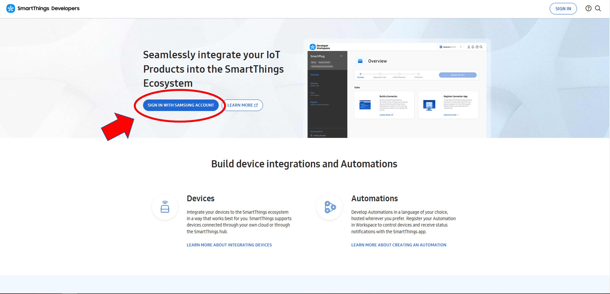
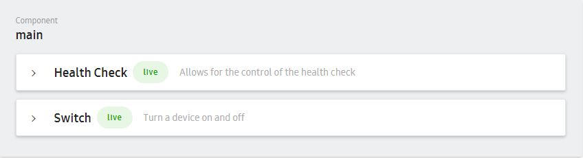
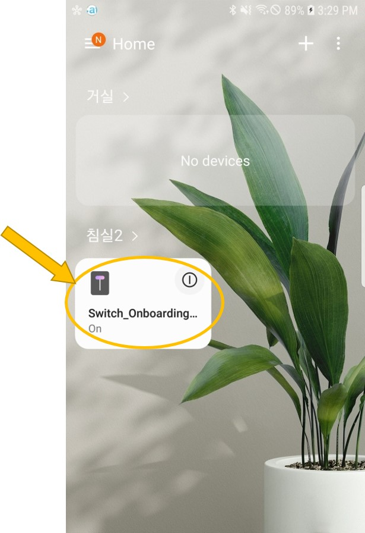

# Getting Started for Direct-connected device

SmartThings Direct-connected devices are Wi-Fi enabled devices that use the SmartThings Platform as their primary cloud infrastructure. And these devices will use the MQTT protocol for communication.

This article demonstrates how to integrate a direct-connected device with SmartThings.

## Workflow

When developing a new direct-connected device application with SmartThings Device SDK, you will progress through the following steps. You can also refer to the [Code Lab data of the 2019 Samsung Developer Conference](https://developer.samsung.com/codelab/smartthings/smartthings-device-sdk/overview.html). It will be more practical for you to understand the SmartThings Device SDK.

- [Setup Environment](#Setup Environment)

- [Register a Device](#Register a Device)

- [Develop a Device Application](#Develop a device application)

    

&nbsp;

## Setup Environment

The first thing you need to do is set up your programming environment.

### Get SmartThings Device SDK source code

There are two git repositories for working with the SmartThings Device SDK. The first git repository is for the Internet of Things (IoT) core device library itself, while the second git repository is for sample device applications that use this IoT core device library on the original chipset vendor's SDK.

- [IoT Core Device Library](https://github.com/SmartThingsCommunity/st-device-sdk-c)
- [Reference](https://github.com/SmartThingsCommunity/st-device-sdk-c-ref)

#### Download Reference

You can just choose to download the [Reference repository](https://github.com/SmartThingsCommunity/st-device-sdk-c-ref) from GitHub, if you use a chipset that has already been ported. In this case, the `IoT Core Device Library` and `a chipset SDK` can be easily downloaded as submodules in this Reference repository through the predefined `setup.sh` script. If you are the first to use this SmartThings Device SDK, we recommend that you use the [Reference repository](https://github.com/SmartThingsCommunity/st-device-sdk-c-ref) for easier understanding.

From the terminal, navigate to the directory you want the SmartThings Device SDK to locate and clone it using the following git command:

```sh
$ cd ~
$ git clone https://github.com/SmartThingsCommunity/st-device-sdk-c-ref.git
```

> **Note** :
>
> For the rest of this document, we will assume the above path (~/st-device-sdk-c-ref) is the default reference source code.

You can use a script to automatically download the `IoT Core Device Library` and `a chipset vendor's SDK` as follows:

```sh
$ cd ~/st-device-sdk-c-ref
$ ./setup.sh
    Usage: ./setup.sh CHIP_NAME
- - - - - - - - - - - - - - - - - - -
    ex) ./setup.sh esp8266
    ex) ./setup.sh esp32
    ex) ./setup.sh rtl8195
    ex) ./setup.sh rtl8720c
    ex) ./setup.sh rtl8721c
    ex) ./setup.sh emw3166

$ ./setup.sh esp8266                       # ./setup.sh {chip_name}
```

### Create device identity

In order for your IoT device to connect to the SmartThings Platform, there are required device authentication data.

Open a terminal window and run the following `stdk-keygen.py` script to create a Device Identity.

```sh
$ cd ~/Workspace/st-device-sdk-c-ref/iot-core/tools/keygen/
$ python3 stdk-keygen.py –firmware switch_example_001
Use following serial number and public key
for the identity of your device in Developer Workspace.

Serial Number:
STDK**E90W***uCX

Public Key:
nFN5x***uQusQ****ZHoBSFaAoP9***kNdLnjDJRew=

$ tree
.
├── output_STDK**E90W***uCX
│   ├── device_info.json
│   ├── device.pubkey.b64
│   └── device.seckey.b64
├── README.md
└── stdk-keygen.py

1 directory, 5 files

$ cat output_STDK**E90W***uCX/device_info.json
{
  "deviceInfo": {
    "firmwareVersion": "switch_example_001",
    "privateKey": "dH**JKMRD5X****BaV+fGoXa3qZfNW3V****jHXOmd0=",
    "publicKey": "nFN5x***uQusQ****ZHoBSFaAoP9***kNdLnjDJRew=",
    "serialNumber": "STDK**E90W***uCX"
  }
}
```

Copy the Serial Number and Public Key after running the command. You will need to upload these values to the SmartThings Platform via [Developer Workspace](https://smartthings.developer.samsung.com/workspace/projects) during the next phase.

If you create a device identity with a command with an option like above,  You can get the ready-to-use `device_info.json` file directly.

### Setup toolchain

You must setup a toolchain according to each chipset you selected.

***Example for ESP8266*** :

*In fact, ESP8266 supports multiple host environments including Windows, Linux, and macOS. But, based on experience, compile times are significantly faster on Linux. Therefore, we will only describe the Linux environment. And yet, if you prefer to use another environment, please refer to the Espressif's guideline matched on the Espressif Doc site. For more details, see the following document.*

- *[ESP8266 Toolchain for Linux](https://docs.espressif.com/projects/esp8266-rtos-sdk/en/latest/get-started/linux-setup.html)*

*In order to use the pre-supplied build script(e.g. `build.sh`), please extract [the toolchain](https://dl.espressif.com/dl/xtensa-lx106-elf-linux64-1.22.0-100-ge567ec7-5.2.0.tar.gz) into `~/esp/xtensa-lx106-elf/` directory like the original Expressif guide. And according to the above Espressif guideline, you will need to add the toolchain path to your PATH environment variable in ~/.profile file. But it is not necessary if you use the pre-supplied build script. Because that path is automatically exported in the build script.*

> ***Info :***
> *The ESP8266 example of SmartThings Device SDK was developed from the 19cfb19 commit ID based on ESP8266_RTOS_SDK v3.2.*


***Example for ESP32*** :

- *[ESP32 Toolchain for Linux](https://docs.espressif.com/projects/esp-idf/en/stable/get-started/linux-setup.html)*

*In order to use the pre-supplied build script(e.g. `build.sh`), please extract [the toolchain](https://dl.espressif.com/dl/xtensa-esp32-elf-linux64-1.22.0-80-g6c4433a-5.2.0.tar.gz) into `~/esp/xtensa-esp32-elf/` directory like the original Expressif guide. And according to the above Espressif guideline, you will need to add the toolchain path to your PATH environment variable in ~/.profile file. But it is not necessary if you use the pre-supplied build script. Because that path is automatically exported in the build script.*

> ***Info :***
>
> *The ESP32 example of SmrtThings Device SDK was developed from the beb34b5 commit ID based on esp-idf v3.3.*


***Example for RTL8195***

- *Install [mbed Microcontroller](https://os.mbed.com/handbook/Windows-serial-configuration) to use the USB serial port on Windows.*
- *Upgrade [DAP F/W](https://www.amebaiot.com/en/change-dap-firmware/)*
  *Recommended DAP F/W is the `DAP_FW_Ameba_V12_1_3-2M.bin`*

> ***Note :***
>
> *You have to proceed the above steps at Windows PC for downloading a binary. But you have to build the source code on the cygwin or linux for this chipset.*


## Register a Device

Now that the programming environment is setup, you need to create project and register device information to the SmartThings Platform.

First, please sign in to the [Developer Workspace](https://smartthings.developer.samsung.com/workspace/) with a Samsung Account.



### Create a new project

To create project for direct connected device. Please select select _New Project_ &rightarrow; _Device Integration_ &rightarrow; _Direct-connected_  


&nbsp;

### Add a device profile

A device profile contains the components, capabilities, and metadata (ID, name, etc.). This information defines the actions and attributes that an IoT device can perform.

Click the _DEFINE DEVICE PROFILE_ &rightarrow; _ADD A DEVICE PROFILE_ and then fill out required information (e.g. Basic infor, Component & Capability, UI display)


&nbsp;

The "[Health Check](https://smartthings.developer.samsung.com/docs/devices/health.html)" capability is automatically added for all direct connected devices. Please leave it and add your capabilities



&nbsp;

### Add a device onboarding

The device onboarding guides device owners when their device is first registering and connecting to SmartThings.  You can customize the screens presented by adding a device onboarding.  The ownership validation type is also defined at this stage.


&nbsp;  


### Add a product info

The product info defines how this device is shown at SmartThings mobile app catalog. 
You can define device’s category and its regional availability.

  

&nbsp;  
  

### Deploy your device to test

You can start testing by deploying your device to test from _Test_ &rightarrow; _Test Devices_ or _Overview_ page.  You will be able to see your device in the SmartThings mobile app when in Developer Mode only after it has been deployed for testing.
- [Official Publishing Process](https://smartthings.developer.samsung.com/docs/devices/publishing/publishing-basics.html)


&nbsp;  

### Register test devices

You can add identity of device for authenticating your device to SmartThings cloud. This requires device information like serial number and device public key (ED25519).
Because maximum number of test device is limited per user, Once you reaches maximum number of test device, you should remove one of existing one.


This example shows how to create ED25519 key pair with SDK tools. You can get device_info.json file as a result from tools/keygen/linux/output_{ serialNumber}

Linux version of key generator (keygen) utility is located at st-iot-device-sdk-c-reference/iot-core/tools/keygen/ or st-device-sdk-c/tools/keygen/
Serial number for testing device would be randomly generated by this tool which has STDK + 12-digit alphanumberic format.

```sh
$ cd ~/Workspace/st-device-sdk-c-ref/iot-core/tools/keygen/
$ python3 stdk-keygen.py –firmware switch_example_001
Use following serial number and public key
for the identity of your device in Developer Workspace.

Serial Number:
STDK**E90W***uCX

Public Key:
nFN5x***uQusQ****ZHoBSFaAoP9***kNdLnjDJRew=
```

Copy `STDK**E90W***uCX` from keygen output and paste it into “Device serial number” field of “Register A Test Device” page.
Copy public key string from keygen output (`nFN5x***uQusQ****ZHoBSFaAoP9***kNdLnjDJRew=` in this example) and paste it into “Device Public Key” field.


&nbsp;  

### Generate Device QR code
Using device QR code could be helpful while device onboarding. QR code should have format like below. (Please refer here for more details)

**{Your mnId}**: 4-digit alphanumeric mnId of your account  
**{Device onboardingId}**: 3-digit number Onboarding ID, you can find it from your developer workspace project “Device Onboarding” > “Other Info” page  
**{Device serialNumber}**: device serial number which is registered at your developer workspace project

```
https://qr.samsungiots.com/?m={Your mnId}&s={Device onboardingId}&r={Device serialNumber}
```

You can simply generate QR code with using below python3 script
```python
import qrcode

mnid = 'FFFF' # "FFFF" is an example. you should replace it with yours
onboardingId = '111' # "111" is an example. you should replace it with yours
serialNumber = 'STDKtest0001' # "STDKtest0001" is an example. you should replace it with yours
qrUrl = 'https://qr.samsungiots.com/?m=' + mnid + '&s=' + onboardingId + '&r=' + serialNumber
img = qrcode.make(qrUrl)
img.save(serialNumber + '.png')
qrcode.QRCode(box_size=10, border=4)
```

### Download onboarding_config.json

This is the information that the IoT device must have in order to connect to the SmartThings Platform.

If you use a sample device application from this git repository, please download it and then, just overwrite the existing `onboarding_config.json` file is in the `main` directory of sample device application with the new one you downloaded. In fact, overwriting is just one of several possible ways to inject it to the device. If the json information is guaranteed to be a parameter in the `st_conn_init()` function, you can refer to it differently according to your own development way.


&nbsp;  
&nbsp;  

## Develop a device application

You have set up the environment and registered a device, so now it is time to develop a new device application in the SmartThings Device SDK Reference repository.

### Create a new device project

An easy way to get started is to branch out one of the example projects provided in the git repository. We will use the "switch_example" application from the SmartThings Device SDK Reference directory here.

```sh
# Full path of the ESP8266
~/st-device-sdk-c-ref/apps/esp8266/switch_example/
```

### Update device information

Your IoT device needs two pieces of information when connecting to the SmartThings Platform :

- Device Identity
- onboarding_config.json

1. Device Identity

   Device identity provides data that need to be sent for authentication with the server. There are two different packets of information, one is ED25519 and the other is X.509.

   - **ED25519**

     All of the device identity data are included in the `device_info.json` file in the `main` directory of the device application.

     If you create a device identity with a command with an option like `python3 stdk-keygen.py --firmware switch_example_001` like the first phase,  you can get the ready-to-use `device_info.json` file directly. In this case, please make sure you overwrite the existing `device_info.json` file with the new one you created.

     ```sh
     # Overwrite device_info.json with a new one
     $ cp ./output_STDK**E90W***uCX/device_info.json ~/st-device-sdk-c-ref/apps/esp8266/switch_example/main/
     ```

     > **Note :**
     >
     > If you are using the `device_info.json` file, please disable the build configuration associated with SmartThings Non-Volatile memory partition(STNV for short) as follows. Once again, don't set the build configuration below to `y`. :
     >
     > `CONFIG_STDK_IOT_CORE_SUPPORT_STNV_PARTITION=`

     But, the manufacturers cannot place the device identity data on the source code because it is not possible to build and flash each time for each device. To resolve this problem in the commercial level device application, these device identity data for each device should be flashed into a secure partition area during the manufacturing process and a method to access data stored in a secure partition area should be implemented for each chipset.

     For Espressif chipset, we have provided these solutions(e.g. a secure partition area(we call it STNV) and a method to access data stored in STNV) as an example, so please refer to it. You can find this example in the source code with the `CONFIG_STDK_IOT_CORE_SUPPORT_STNV_PARTITION` keyword.

     **[The example of flashed items in the Espressif chipset]**

     | Flashed items | Type | Description                   | Examples                 |
     | :------------ | :--- | :---------------------------- | :----------------------- |
     | PKType        | data | PubKey Algorithm type         | ED25519                  |
     | CACert        | file | Server CA Certificate         | root.crt.pem             |
     | PublicKey     | file | Client (= Device) Public key  | device.pubkey.b64        |
     | PrivateKey    | file | Client (= Device) Private key | device.seckey.b64        |
     | SerialNum     | data | Device Serial Number          | SN12345678F              |

     > **Note :**
     >
     > If you want to flash the device identity data in a specific partition, you should set the build configuration below to `y`. : 
     >
     > `CONFIG_STDK_IOT_CORE_SUPPORT_STNV_PARTITION=y`

   - **X.509**

     It will be supported later.

2. onboarding_config.json

   Place the `onboarding_config.json` file created during the device registration phase in the `main` directory of device application. Please make sure you overwrite the existing `onboarding_config.json` file with the new one you created like `device_info.json` file above.

   ***Example***

   ```sh
   # Location for switch_example app of ESP8266
   ~/st-device-sdk-c-ref/apps/esp8266/switch_example/main/onboarding_config.json
   ```

   ```sh
   # Example of onboarding_config.json
   {
     "onboardingConfig": {
       "deviceOnboardingId": "OI_SWITCH_01",
       "mnId": "****",
       "setupId": "001",
       "vid": "VID_SWITCH_01",
       "deviceTypeId": "Switch",
       "ownershipValidationTypes": [
         "BUTTON"
       ],
       "identityType": "ED25519",
       "deviceIntegrationProfileKey": {
         "id": "123e4567-e89b-12d3-a456-426614174000",
         "majorVersion": 0,
         "minorVersion": 1
       }
     }
   }
   ```

   - deviceOnboardingId : It is a prefix to be used for the SSID of Soft-AP during Easy-setup process. This value comes from `Device Onboarding ID` when doing "Create a device information" on the DevWS. By default, the last four digits(e.g. 7c16) of the example below represent the last four digits of the Serial Number of device.
     - Example of SSID : OI_SWITCH_01_E4mnId......7c16
   - mnId : Manufacturer ID. A unique four-letter ID assigned to SmartThings developers (individual MNID) or enrolled organizations (company MNID) that can be viewed at "My Page > MNID".
   - setupId : a unique three-digit number. This value comes from `Setup ID` when doing "Create device onboarding information" on the DevWS.
   - vid :   An alphanumeric identifier for your device. This value comes from `Vendor ID` when doing "Create a device profile" on the DevWS.
   - deviceTypeId : This determines the device's icon and default UI layout in the SmartThings app. This is the value you selected from the value given as a list when doing "Create a device profile".
   - ownershipValidationTypes : This is the type of ownership confirmation used during onboarding process. This value comes from `Confirm Method` when doing "Create a device profile" on the DevWS. Currently, there are four supported types.
     - JUSTWORKS
     - BUTTON
     - PIN
     - QR

   - identityType : A unique certificate or public key pair type used to authenticate a device on SmartThings Platform. You can choose between
     - ED25519
     - *X.509 (will be supported)*
   - deviceIntegrationProfileKey : information to indicates your device's functionalities at SmartThings Platform.

### Develop device application

A device application is developed using the APIs provided by the IoT Core Device Library. We recommend reuse of the pre-supplied sample device applications, like `switch_example`. This allows for rapid development as you begin to develop your new device. Please refer to the [API references](https://github.com/SmartThingsCommunity/st-device-sdk-c/blob/master/doc/STDK_APIs.pdf) related to the IoT core device library as shown:

- connection management
  - st_conn_init()
  - st_conn_set_noti_cb()
  - st_conn_start()
  - st_conn_cleanup()
  - st_conn_ownership_confirm()

- capability management
  - st_cap_handle_init()
  - st_cap_cmd_set_cb()
  - st_cap_attr_create_int()
  - st_cap_attr_create_number()
  - st_cap_attr_create_string()
  - st_cap_attr_create_string_array()
  - st_cap_attr_free()
  - st_cap_attr_send()

***Main function example for ESP8266*** :

```sh
void app_main(void)
{
    /**
      SmartThings Device SDK aims to make it easier to develop IoT devices by providing
      additional st_iot_core layer to the existing chip vendor SW Architecture.

      That is, you can simply develop a basic application
      by just calling the APIs provided by st_iot_core layer like below.

      // create a iot context
      1. st_conn_init();

      // create a handle to process capability
      2. st_cap_handle_init(); (called in function 'capability_init')

      // register a callback function to process capability command when it comes from the SmartThings Server.
      3. st_cap_cmd_set_cb(); (called in function 'capability_init')

      // process on-boarding procedure. There is nothing more to do on the app side than call the API.
      4. st_conn_start(); (called in function 'connection_start')
     */

    unsigned char *onboarding_config = (unsigned char *) onboarding_config_start;
    unsigned int onboarding_config_len = onboarding_config_end - onboarding_config_start;
    unsigned char *device_info = (unsigned char *) device_info_start;
    unsigned int device_info_len = device_info_end - device_info_start;

    int iot_err;

    // create a iot context
    ctx = st_conn_init(onboarding_config, onboarding_config_len, device_info, device_info_len);
    if (ctx != NULL) {
        iot_err = st_conn_set_noti_cb(ctx, iot_noti_cb, NULL);
        if (iot_err)
            printf("fail to set notification callback function\n");
    } else {
        printf("fail to create the iot_context\n");
    }

    // create a handle to process capability and initialize capability info
    capability_init();

    gpio_init();
    register_iot_cli_cmd();
    uart_cli_main();
    xTaskCreate(app_main_task, "app_main_task", 4096, NULL, 10, NULL);

    // connect to server
    connection_start();
}

```

### Build & Flash the App

Go to the root directory of the SmartThings Device SDK Reference git repo. and execute the build script(build.sh) with the below parameter.

```sh
# Example for ESP8266
$ cd ~/st-device-sdk-c-ref/
$ ./build.sh apps/esp8266/switch_example             # ./build.sh {app_directory}
```

After compiling, following results can be seen. In fact, as you know, we have to flash these results according to the binary download method that exists per chipset.

```sh
# Example for ESP8266
$ cd ~/st-device-sdk-c-ref/
$ tree output/ -L 3
output/
`-- esp8266
    ├── iotcore_switch_example_20200729_65a1678_0a8cbe1
    │   ├── address_info.txt
    │   ├── bootloader.bin
    │   ├── debug
    │   ├── ota_data_initial.bin
    │   ├── partitions.2MB.bin
    │   └── switch_example.bin

```

In case of Espressif chipset(e.g. ESP8266, ESP32), you can now run the following command to flash the entire binaries(e.g. app, bootloader, and init data bin) to the chipset.

```sh
# Example for ESP8266
# ./build.sh {app_directory} {option}
$ cd ~/st-device-sdk-c-ref/
$ ./build.sh apps/esp8266/switch_example flash
```

The serial port needs to be matched to the computer environment for serial port flashing. For example, the settings for serial port flashing can be configured with `menuconfig` option in Espressif. If the serial port setting does not match your environment, please execute the following:

> Note :
> The `menuconfig` option is only supported on the Espressif chipset. If you use a different chipset, please set it according to the selected original chipset guide.
```sh
# Example for ESP8266
# ./build.sh {app_directory} {option}
$ cd ~/st-device-sdk-c-ref
$ ./build.sh apps/esp8266/switch_example menuconfig
```

Plus, You don't need to run `./build.sh appes/esp8266/switch_example` before running `./build.sh appes/esp8266/switch_example flash`, this will automatically rebuild everything that needs to be built before flashing.

For more details about flashing and monitoring, please refer to the [README](https://github.com/SmartThingsCommunity/st-device-sdk-c-ref/blob/master/README.md) file.

### Test

The SmartThings App should be used to control an IoT device that is running with the SmartThings Platform. Go to Google Play or the iOS App Store and download the SmartThings app on your phone.

| Step | Description                                                  |
| :--: | ------------------------------------------------------------ |
|  1   | **Enable developer mode**<br>You must enable the `Developer Mode` in the SmartThings app before testing.<br>For more details, please refer to the link below.<br>https://smartthings.developer.samsung.com/docs/testing/developer-mode.html<br> |
|  2   | **Reset the device**<br>Just push the reset button of device.<br><br>If you use an Espressif chipset, you can also run the `monitor` command to reset the device in the console window like below.<br>  $ cd ~/st-device-sdk-c-ref<br>  $ ./build.sh apps/esp866/switch_example monitor    # This is only for Espressif chipset. |
|  3   | **Add device(Onboarding Process)**<br>There are two ways to add a device in the SmartThings application. You can proceed in one of the two ways below.<br>- Select the `Device Onboarding Name` via "My Testing Devices" menu. <br><br><br>- Use the automatic Detection pop-up window. By default, the last four digits(e.g. 7c16) of the example detection pop-up below represent the last four digits of the Serial Number of device.<br> |
|  4   | **Control & Monitor a device**<br>Now that your device is on the SmartThings App. If there is no problem during above onboarding process, it means your device is well registered to the SmartThings Platform. <br><br>Control & Monitor your device via the App and make sure the App is working the way you think it should.<br> |
