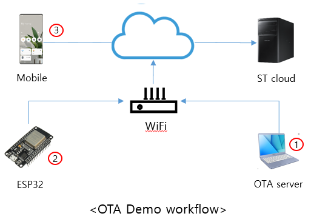

OTA demo
=================

This document describes how the **Firmware Update** capability could works with SmartThings Platform and SmartThings Device SDK enabled device to help building device manufacturer own OTA (over-the-air) firmware update service.

This document contains
* [Adding **Firmware Update** capability to project](./ota_demo.md#adding-firmware-update-capability-to-project)
* [OTA demo sequence](./ota_demo.md#ota-demo-sequence)
* [OTA demo network environment](./ota_demo.md#ota-demo-network-environment)
* [Preparing OTA Server](./ota_demo.md#preparing-ota-server)
* [Preparing Certificate](./ota_demo.md#preparing-certificate)
* [Preparing Server Contents](./ota_demo.md#preparing-server-contents)
* [Running web server with python3](./ota_demo.md#running-web-server-with-python3)
* [OTA demo device application](./ota_demo.md#ota-demo-device-application)
* [How to run OTA demo](./ota_demo.md#how-to-run-ota-demo)

***

Adding **Firmware Update** capability to project
---------------------------------------------
SmartThings Device SDK enabled device could communicate with SmartThings mobile application by adding **Firmware Update** capability to project at [Developer Workspace](https://smartthings.developer.samsung.com/workspace/)


***

OTA demo sequence
-----------------
Below diagram describes how the OTA demo works.

Because this is an example only for demo purpose, each manufacturer should establish their own method.


***

OTA demo network environment
----------------------------
Typical OTA environment for production would be like below - STDK device located at home network but the SmartThings platform and OTA server located at internet.


But we will locate OTA server inside of home network only for demo purpose and use IP address instead of domain name.


***

Preparing OTA Server
-----------------------

The RaspberryPi would be used as an ubuntu machine as a OTA server.   
Please refer [ubuntu wiki](https://wiki.ubuntu.com/ARM/RaspberryPi) to install ubuntu on it.   
But this demo doesn't requires any hardware specific feature for server. your can use any ubuntu machine.

The OTA demo server will provide
* https connection
* latest firmware version information
* latest firmware binary which is signed with server certificate.
***

Preparing Certificate
---------------------
This demo requires server certificate, key, root certificate for https connection.    
And root key file is required for firmware signing.

Below shell script will generate `server.crt`, `server.key` for OTA demo server, `root.pem` for STDK device and `root.key` for firmware signing and 'public_key.pem' for checking firmware validation.   
The IP address (e.g. 192.168.1.3) instead of `yourServerDomain` in this demo.
```sh
#!/bin/sh
ROOT_DOMAIN_NAME=yourRootDomain
SERVER_DOMAIN_NAME=yourServerDomain

openssl req -new -nodes -text -out root.csr -keyout root.key -subj "/CN=$ROOT_DOMAIN_NAME"
openssl x509 -req -in root.csr -text -days 3650 -extfile /etc/ssl/openssl.cnf -extensions v3_ca -signkey root.key -out root.crt

openssl req -new -nodes -text -out server.csr -keyout server.key -subj "/CN=$SERVER_DOMAIN_NAME"
openssl x509 -req -in server.csr -text -days 365 -CA root.crt -CAkey root.key -CAcreateserial -out server.crt

openssl rsa -in root.key -pubout -out public_key.pem
openssl x509 -inform PEM -in root.crt > root.pem
```
***

Preparing Server Contents
-------------------------------
This demo server will provide two types of contents. because these contents are used only for demo purpose. We strongly suggest to use your own method for deciding firmware update and firmware validation.

* **version_info.json**
  - example of vendor specific latest firmware information. demo device application will decide firmware update is required for running device or not by reading this information.
  - file format
    + `latest`: the latest firmware version string   
    + `upgrade`: a list which current running firmware allowed to upgrade to `latest` version   
    + `polling`: period of checking new firmware availability by days (e.g. 3 means check new firmware available once for every 3 days) 
    ```json
    {
      "versioninfo": {
	  "latest": "ota_demo_ver2",
	  "upgrade": ["ota_demo_ver1"],
	  "polling": "1"
      }
    }
    ```
* **signed_ota_demo.bin**
  - OTA demo will use signed firmware to prevent updated with unauthorized firmware.
  - Install python package
    ```json
    python -m pip install colored
    ```
  - Prepare python script    
   `firmware_sign.py`   
    ```python
    #!/usr/bin/python

    import os
    import sys
    import struct
    import binascii

    from termcolor import colored

    error = colored('[ERROR]', 'red')
    info = colored('[INFO]', 'green')

    OTA_FOOTER_SIZE=6

    def help():
        text = colored('Usage: python ./firmware_sign.py FIRMWARE_NAME PRIVATE_KEY_NAME', 'green')
        print(text)
        print('- - - - - - - - - - - - - - - - - - - - - - - - - - - - -')
        print('ex) python ./firmware_sign.py ota_demo.bin root.key \n')
        exit()

    def ota_update_signature(signature_name, firmware_name, out_file):
        print info, "Updating signature "

        try:
            fd = open(out_file, 'wb+')
        except IOError:
            print error, "File does not exist"
            return False

        try:
            sign_fd = open(signature_name, 'rb+')
        except IOError:
            print error, 'Signature does not exist'
            fd.close
            return False

        # write signature's header
        fd.write("\xFF\xFF\xFF\xFF\x00\x00")

        # write signature
        fd.write(sign_fd.read())

        # write footer
        fd.write("\x00\x00\xFF\xFF\xFF\xFF")

        fd.close
        sign_fd.close
        return True

    def ota_check_firmware_validation(firmware_name):

        print info, "Checking firmware validation..."

        try:
            file = open(firmware_name, 'rb+')
        except IOError:
            print error, 'File does not exist'
            exit()

        file.seek(-OTA_FOOTER_SIZE,2)

        footer_info = file.read(OTA_FOOTER_SIZE)
        first_footer = struct.unpack('HHH',footer_info)[2]
        second_footer = struct.unpack('HHH',footer_info)[1]

        if first_footer != 0xffff or second_footer != 0xffff:
            file.close
        else :
            print info, "Firmware is already signed \n", 
            file.close
            exit()

    def checkArgument():
        if len(sys.argv) != 3:
            help()
            return False
        else:
            return True

    def main():

        # check argument
        result = checkArgument()
        if result == False:
            exit()

        firmware_name = sys.argv[1]
        key_name = sys.argv[2]

        # check signature 
        result = ota_check_firmware_validation(firmware_name)
        if result == False:
            exit()

        # get hash
        os.system('openssl dgst -sha256 -binary -out firmware.hash '+ firmware_name)

        # signing request
        os.system('openssl dgst -sha256 -sign ' + key_name + ' -out sha256.sign firmware.hash')

        # create signature
        result = ota_update_signature('sha256.sign', firmware_name, 'new_sha256.sign')

        if result == True:
            # create new firmware signed
            os.system('cat '+ firmware_name + ' new_sha256.sign > signed_'+firmware_name)

            text = colored('signed_'+firmware_name, 'yellow')
            print('- - - - - - - - - - - - - - - - - - - - - - - - - -')
            print "OTA signging Completed!!  (Output :", text,")"
            print('- - - - - - - - - - - - - - - - - - - - - - - - - -')

        # clear all data
        os.system('rm new_sha256.sign sha256.sign firmware.hash')


    if __name__ == '__main__':
        main()
    ```
  - _firmware_sign.py_ will append encrypted hash of firmware as a signature at the end of firmware file. 
  - Sign firmware with `root.key` which is generated from [Preparing Certificate](./ota_demo.md#preparing-certificate)
    ```sh
    $ python ./firmware_sign.py ota_demo.bin root.key
    ```

***
Running web server with python3
-------------------------------
Python could provide easy way to build simple web server with minimal effort.

1. Make web server root directory
   ```sh
   $ mkdir -p ~/ota_demo/dir
   ```

2. Copy contents from [Preparing Server Contents](./ota_demo.md#preparing-server-contents)
   ```sh
   $ cp version_info.json ~/ota_demo/dir
   $ cp signed_ota_demo.bin ~/ota_demo/dir
   ```

3. Copy certificate
   ```sh
   $ cp server.crt ~/ota_demo
   $ cp server.key ~/ota_demo
   ```

4. Prepare python script    
   `https_server.py`
   ```python
   from http.server import HTTPServer, BaseHTTPRequestHandler, SimpleHTTPRequestHandler
   import ssl

   serverKeyFile = "/home/[username]/ota_demo/server.key"
   serverCertFile = "/home/[username]/ota_demo/server.crt"
   
   httpd = HTTPServer(('', 4443), SimpleHTTPRequestHandler)
   
   httpd.socket = ssl.wrap_socket (httpd.socket,
			               keyfile=serverKeyFile,
			               certfile=serverCertFile, server_side=True)
   httpd.serve_forever()
   ```

5. Run demo web server python script
   ```sh
   $ cd ~/ota_demo/dir
   $ python3 ../https_server.py
   ```

6. Configure iptables
   ```sh
   $ sudo iptables -I INPUT 1 -p tcp --dport 4443 -j ACCEPT
   ```

7. Test with connection with curl with `root.crt`
   ```sh
   $ curl --cacert ./root.crt "https://192.168.1.3:4443"
   ```
***

OTA demo device application
-------------------------------
OTA demo device application runs on ESP32 chipset.   

This application will provide
* example of interacting with **Firmware Update** capability.
* example of https client connection with root certificate.
* example of signed firmware validation.

Please refer details in [here](../apps/esp32/ota_demo/README.md)
***

How to run OTA demo
-------------------
If you prepare all the things in document, you already have OTA server and OTA supported STDK device.



1. Run OTA server - refer [_Running web server with python3_](./ota_demo.md#running-web-server-with-python3)
2. Power on demo device - refer [_OTA demo device application_](./ota_demo.md#ota-demo-device-application)
3. On-board demo device with SmartThings mobile application
4. Select device card from SmartThings mobile application

      

5. Select _more_ > _Information_ then you can find _Firmware update_ button enabled
6. Press _Firmware update_ button 

      

***
